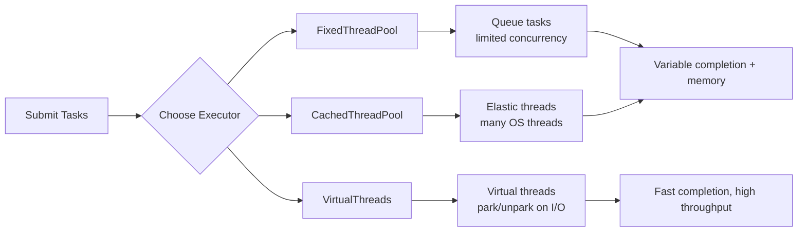

# Benchmark Diagram — Virtual Threads vs Platform Threads

## 1. High-level comparison (ASCII)

```
Platform Threads Model                               Virtual Threads (Loom)
──────────────────────                               ──────────────────────
[Task 1] ─┐                                         [Task 1] ─┐
[Task 2] ─┼─> OS Thread 1 ─ Blocking -> CPU         [Task 2]  │
[Task 3] ─┘                                         [Task 3] ─┼─> Carrier Thread A
[Task 4] ─┐                                         [Task 4] ─┘
[Task 5] ─┼─> OS Thread 2 ─ Blocking -> CPU         [Task 5] ─┐
[Task 6] ─┘                                         [Task 6] ─┼─> Carrier Thread B
                                       ...            ...

Key differences:
- Platform: each blocking task ties up an OS thread (high memory, context switching).
- Virtual: blocking tasks park and free carrier threads; millions of virtual threads map onto few carriers.
```

---

## 2. Scheduling flow (Detailed)

```
Virtual threads lifecycle:

1. Create VirtualThread T
2. T runs on Carrier C (OS thread)
3. T performs blocking I/O -> JVM parks T and unmounts it from C
4. C is returned to pool to run other virtual threads
5. When I/O completes, JVM schedules T on an available carrier and resumes continuation

Platform threads lifecycle:

1. Create PlatformThread P (OS thread)
2. P runs on CPU
3. P performs blocking I/O -> OS blocks P (remains assigned)
4. OS must context-switch to another thread when CPU available

Result: Virtual threads avoid blocking OS threads during I/O.
```

---

## 3. Structured Concurrency — Scope diagram

```
StructuredTaskScope {                       // parent scope
  fork(taskA)  -> subtask A                 // child1
  fork(taskB)  -> subtask B                 // child2
  join(); throwIfFailed();                  // wait & error propagation
} // exiting scope cancels unfinished child subtasks

Benefits:
- No orphaned tasks
- Deterministic lifecycle
- Easier error handling
```

---

## 4. Benchmark flow (how to interpret results)

```
1) Run baseline (Fixed thread pool)
   - Record time T1, threads used, throughput
2) Run cached thread pool
   - Record T2
3) Run virtual threads
   - Record T3 (expected << T1)
4) Run structured concurrency variant
   - Record T4 (≈ T3)

Interpretation:
- Lower time & higher throughput favor virtual threads.
- Thread.activeCount() shows carrier vs platform threads difference.
```

---

## 5. Mermaid flow (optional)



---

